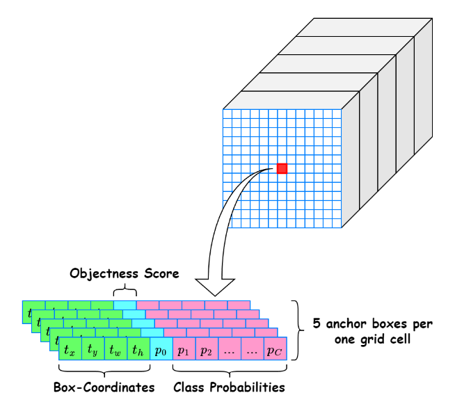
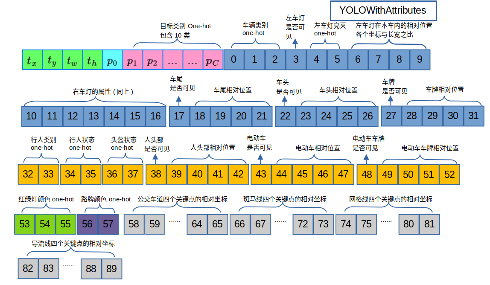
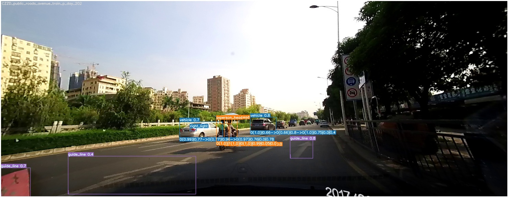
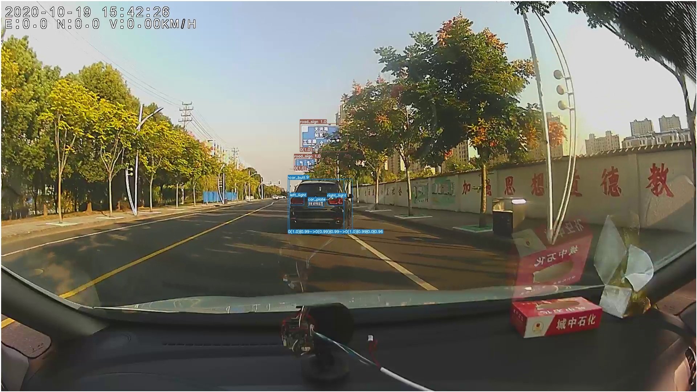
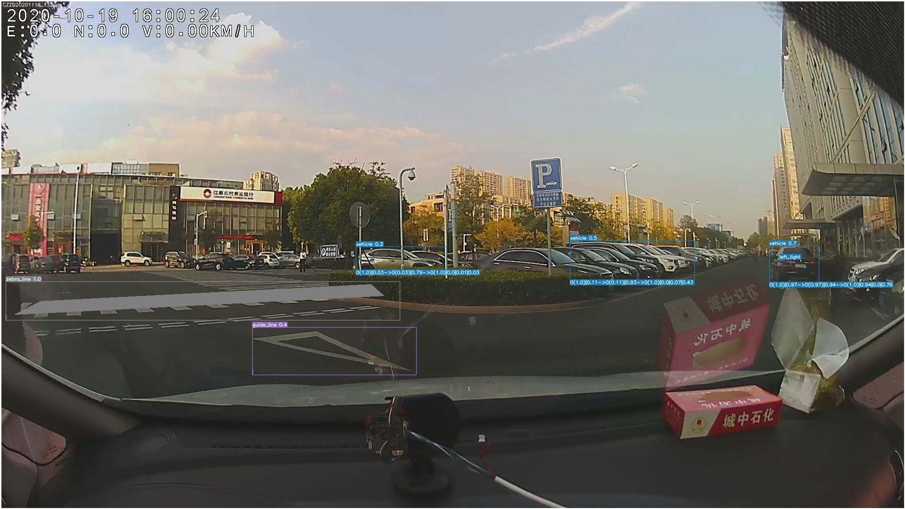
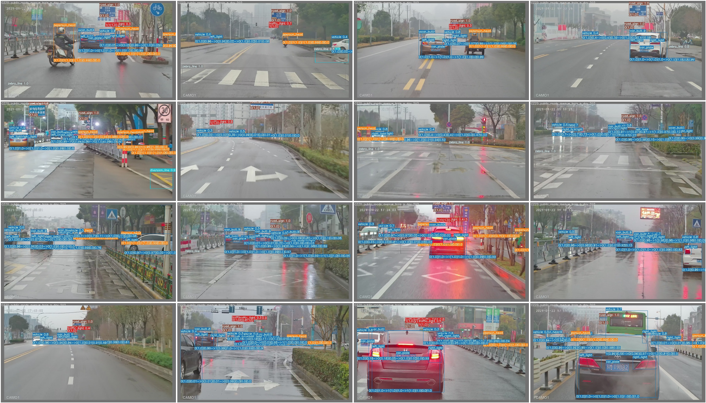

# YOLOv7WithAttributes

本项目fork自官方[YOLOv7](https://github.com/WongKinYiu/yolov7)，旨在解决其只能预测目标位置和类别，而无法得到目标更详细属性信息的问题。

## 功能特性

本项目主要应用场景是道路物体识别，可以识别以下十种类别的物体，包括车辆、行人、公交站、交通灯、导向线、路标、公交车道、斑马线、网格线和导流线，同时每种物体可以识别出以下几种类别的子属性：

- 车辆：车尾的位置、车头的位置、左车灯的位置、右车灯的位置、车牌的位置、车的类型、左车灯的亮灭、右车灯的亮灭
- 行人：人头的位置、骑的摩托车的位置、骑的摩托车的车牌的位置、人的类别、人的状态、是否戴头盔
- 红绿灯：颜色
- 路牌： 颜色
- 公交车道：四个关键点的位置
- 斑马线：四个关键点的位置
- 网格线：四个关键点的位置
- 导流线：四个关键点的位置

## 实现细节

由于在画面中，有时候某种属性不一定是可见的，无法知道确切的类别或者位置，所以我们增加若干辅助属性：

- 车辆：左车灯是否可见、右车灯时候可见、车尾时候可见、车头是否可见、车牌时候可见
- 行人：人头时候可见、骑的摩托车时候可见

对于普通的 yolo 算法来说，一般输出的是如下图所示的向量


为了能够预测bbox的属性，在一个 anchor 的输出后面按照如下顺序附上代表所有属性的值，如下图所示，把输出的所有跟属性相关的值的总个数填入 data/chezai-dataset-withAttri.yaml 中的 attribute_outputs 下


由于不同的类别属性也不同，而且需要确保不可见的属性无法贡献该属性的 loss 的计算，所以我们需要如下所示的控制流进行控制不同的类别以及不同的可见性对最终的 loss 的影响

```python
for bbox_index in range(bbox_num):
    gt_box_cls = curr_head_target_classes[bbox_index]

    if(gt_box_cls == 0):...
        ...
        if(curr_head_targets[bbox_index, 7] == 1):
            # calculate the loss of left light status and position
    if(gt_box_cls == 1):...
    if(gt_box_cls == 3):...
    if(gt_box_cls == 5):...
    ...
```

由于需要预测的属性较多，将控制属性的 loss 分为三类，分别是约束可见性的 loss_attr_objection、约束类别的 loss_sub_class 和约束属性位置的 loss_attr_position，并用不同的系数平衡权重，在 hyp.yolov7-withAttri.yaml 中可以修改这六个系数
```python
loss_box_position *= self.hyp['box']          # 约束主类的 bbox 的位置
loss_objection *= self.hyp['obj']             # 约束主类的置信度
loss_class *= self.hyp['cls']                 # 约束主类的类别
loss_attr_objection *= self.hyp['attr_obj']   # 约束属性值的可见性
loss_sub_class *= self.hyp['sub_cls']         # 约束属性值的类别
loss_attr_position *= self.hyp['attr_box']    # 约束属性框的位置
loss = loss_box_position + loss_objection + loss_class + loss_attr_objection + loss_sub_class + loss_attr_position
```

## 安装
Docker environment (recommended)

```
# create the docker container, you can change the share memory size if you have more.
nvidia-docker run --name yolov7 -it -v your_coco_path/:/coco/ -v your_code_path/:/yolov7 --shm-size=64g nvcr.io/nvidia/pytorch:21.08-py3

# apt install required packages
apt update
apt install -y zip htop screen libgl1-mesa-glx

# pip install required packages
pip install seaborn thop

# go to code folder
cd /yolov7
```

## 测试
```
python test.py --weights ./chezai_box_with_attr/train/exp3/weights/epoch_024.pt --data ./data/chezai-dataset-withAttri.yaml --batch-size 16 --img-size 640 --conf-thres 0.25 --iou-thres 0.45 --task test  --device 0 --plot-in-original-size
```

得到的结果如下

```
      carTypeP  carLightVisP   carLightOnP  carLightPosP  carPlateVisP  
     1.0(1767)    0.79(2539)    0.95(2539)    0.78(2539)    0.56(1083)    

      carPlatePosP   carButtVisP   carButtPosP   carHeadVisP   carHeadPosP
     0.35(1083)     0.82(926)     0.82(926)     0.46(120)     0.46(120)

      perTypeP    perStatusP    perHelmetP   perHeadVisP   perHeadPosP   
      1.0(799)     0.98(799)     0.95(799)     0.99(797)     0.89(797)     
      
      perBikeVisP   perBikePosP bikePlateVisP bikePlatePosP
      0.27(496)     0.97(496)      0.2(133)     0.22(133)

      trafficLightColorP        roadSignColorP       busLaneMeanDist     
             0.99(318)             0.99(385)              0.09(18)             

    zebraLineMeanDist      gridLineMeanDist       divLineMeanDist
             0.09(160)               0.09(5)              0.13(26)

    vehicle        613        1831       0.759       0.903       0.921       0.795
    person         613         916        0.85       0.754       0.825       0.547
    bus_station    613          37       0.799       0.757       0.786       0.453
    traffic_light  613         409       0.895       0.645       0.749       0.466
    guide_line     613         560         0.8       0.737       0.767       0.563
    road_sign      613         412       0.611       0.934       0.616       0.412
    bus_lane       613          24       0.529        0.75       0.473       0.213
    zebra_line     613         314       0.731        0.51       0.477       0.305
    grid_line      613          15         0.5       0.333       0.227       0.117
    diversion_line 613          52       0.645       0.489       0.448       0.257
```

## 训练
### 数据准备
```
python ./scripts/chezai_labels_with_attr_convertor.py dataset_path
```

dataset_path 的目录结构为：
```
-- dataset
    - dataset 1
        - img
            - img1.png
            - img2.png
            ...
        - annotations.xml
    - dataset 2
    ...
```
其中 annotations.xml 储存了同文件夹下 img 内所有图片的标注，一个示例为：
```xml
<image id="1" name="CZZD20201118/img/CZZD20201118_10.jpg" width="1920" height="1080">
    <box label="person" occluded="0" source="manual" xtl="441.50" ytl="498.19" xbr="491.68" ybr="641.56" z_order="0">
      <attribute name="person_type">person</attribute>
      <attribute name="helmet">no_wear</attribute>
      <attribute name="id">1</attribute>
      <attribute name="state">person</attribute>
    </box>
    <box label="person_head" occluded="0" source="manual" xtl="453.64" ytl="498.82" xbr="468.72" ybr="518.93" z_order="0">
      <attribute name="id">1</attribute>
    </box>
    <box label="guide_line" occluded="0" source="manual" xtl="839.18" ytl="631.58" xbr="1034.66" ybr="716.26" z_order="0">
    </box>
    <box label="guide_line" occluded="0" source="manual" xtl="556.81" ytl="626.50" xbr="683.83" ybr="710.40" z_order="0">
    </box>
    <box label="vehicle" occluded="0" source="manual" xtl="850.87" ytl="508.37" xbr="958.82" ybr="603.57" z_order="0">
      <attribute name="right_light">no_bright</attribute>
      <attribute name="left_light">no_bright</attribute>
      <attribute name="car_type">car</attribute>
      <attribute name="id">1</attribute>
    </box>
    <box label="left_light" occluded="0" source="manual" xtl="859.48" ytl="538.82" xbr="886.54" ybr="552.34" z_order="0">
      <attribute name="id">1</attribute>
    </box>
    <box label="right_light" occluded="0" source="manual" xtl="926.63" ytl="540.54" xbr="953.19" ybr="552.59" z_order="0">
      <attribute name="id">1</attribute>
    </box>
    <box label="vehicle_butt" occluded="0" source="manual" xtl="858.74" ytl="509.30" xbr="954.42" ybr="602.52" z_order="0">
      <attribute name="id">1</attribute>
    </box>
</image>
<image>... </image>
<image>... </image>
...
```

一张图片对应一个 txt 标签，一个标签每行代表一个物体和其属性信息，由多个值组成，每个值的代表的信息如下，把标签的值的总个数填入 data/chezai-dataset-withAttri.yaml 中的 attribute_targets 下

```
[cls_index(1), x(2), y(3), w(4), h(5), 车辆类别（6），左车灯是否可见（7），左车灯状态（8），左车灯位置（9~12），右车灯是否可见（13），右车灯状态（14），右车灯位置（15~18），车尾是否可见（19），车尾框位置（20~23），车头是否可见（24），车头框位置（25~28），车牌是否可见（29），车牌位置（30~33），人的类别（34），人的状态（35）， 是否带头盔（36），人头是否可见（37），人头的位置（38~41），人骑的车是否可见（42），人骑的车的位置（43~46），电动车车牌是否可见（47），车牌的位置（48~51），红绿灯的颜色（52），路牌的颜色（53），公交车道四个点（54～61），斑马线四个点（62～69），网格线四个点（70～77），导流线四个点（78～85）]
```

- “位置”的四个值指的是：
  - (attributeBox.x - bbox.x) / bbox.w
  - (attributeBox.y - bbox.y) / bbox.h
  - attributeBox.w / bbox.w
  - attributeBox.h / bbox.h
- “四个点”的八个值指的是：
  - keyPoint1.x / bbox.w
  - keyPoint1.y / bbox.h
  - keyPoint2.x / bbox.w
  - keyPoint2.y / bbox.h
  - keyPoint3.x / bbox.w
  - keyPoint3.y / bbox.h
  - keyPoint4.x / bbox.w
  - keyPoint4.y / bbox.h
- 是否可见：不可见（0），可见（1）
- 车灯状态：不可见（-1），不亮（0），亮（1）
- 车辆类别：轿车（0），公交（1），货车（2）
- 人的类别：普通人（0），交警（1）
- 是否戴头盔：不带（0），带（1）
- 红绿灯颜色：绿色（0），红色（1），黄色（2）
- 路牌颜色：蓝色（0），绿色（1）

一个 img1.txt 的结构如下：
```txt
4 0.48862239583333333 0.5899861111111111 0.072984375 0.04286111111111118 -1 -1 -1 -1 -1 -1 -1 -1 -1 -1 -1 -1 -1 -1 -1 -1 -1 -1 -1 -1 -1 -1 -1 -1 -1 -1 -1 -1 -1 -1 -1 -1 -1 -1 -1 -1 -1 -1 -1 -1 -1 -1 -1 -1 -1 -1 -1 -1 -1 -1 -1 -1 -1 -1 -1 -1 -1 -1 -1 -1 -1 -1 -1 -1 -1 -1 -1 -1 -1 -1 -1 -1 -1 -1 -1 -1 -1 -1 -1 -1
5 0.6109322916666666 0.06967592592592593 0.1637604166666667 0.13675925925925925 -1 -1 -1 -1 -1 -1 -1 -1 -1 -1 -1 -1 -1 -1 -1 -1 -1 -1 -1 -1 -1 -1 -1 -1 -1 -1 -1 -1 -1 -1 -1 -1 -1 -1 -1 -1 -1 -1 -1 -1 -1 -1 -1 -1 -1 -1 -1 0 -1 -1 -1 -1 -1 -1 -1 -1 -1 -1 -1 -1 -1 -1 -1 -1 -1 -1 -1 -1 -1 -1 -1 -1 -1 -1 -1 -1 -1 -1 -1 -1
5 0.49286458333333333 0.3765833333333334 0.04635416666666667 0.05168518518518518 -1 -1 -1 -1 -1 -1 -1 -1 -1 -1 -1 -1 -1 -1 -1 -1 -1 -1 -1 -1 -1 -1 -1 -1 -1 -1 -1 -1 -1 -1 -1 -1 -1 -1 -1 -1 -1 -1 -1 -1 -1 -1 -1 -1 -1 -1 -1 0 -1 -1 -1 -1 -1 -1 -1 -1 -1 -1 -1 -1 -1 -1 -1 -1 -1 -1 -1 -1 -1 -1 -1 -1 -1 -1 -1 -1 -1 -1 -1 -1
0 0.3836796875 0.5339305555555556 0.11974479166666666 0.15934259259259262 0 1 0 0.009699447609934403 0.3519669940147593 0.14536122830672857 0.12121564297751182 1 0 0.4900178330651124 0.33668429310244596 0.22517506850506716 0.14312278458945896 1 0.004653995041537717 0.01104073449938972 0.7142795006741771 0.9835551165088033 0 -1 -1 -1 -1 1 0.21856378582923755 0.4013016444883487 0.1836805706580837 0.08890696728456078 -1 -1 -1 -1 -1 -1 -1 -1 -1 -1 -1 -1 -1 -1 -1 -1 -1 -1 -1 -1 -1 -1 -1 -1 -1 -1 -1 -1 -1 -1 -1 -1 -1 -1 -1 -1 -1 -1 -1 -1 -1 -1 -1 -1 -1 -1 -1 -1 -1 -1 -1 -1
```
> 值得注意的是，如果一个属性不可见或者不存在，那么跟它有关的所有值都变成 -1

接着在 scripts 文件夹下面会有 all_chezai_dataset_with_attr.txt 这个文件，里面存放了所有数据的路径，接着进行训练/验证/测试集划分
```
python ./scripts/divide_all_dataset.py ./scripts/all_chezai_dataset_with_attr.txt
```
按照指示输入比例，最后在该文件夹下出现三个文件 all_train_data.txt、all_val_data.txt、all_test_data.txt，将这三个的绝对路径复制到 chezai-dataset-withAttri.yaml 中

### 开始训练
单 GPU 训练
```
python train.py --workers 8 --device 0 --cfg ./cfg/training/yolov7-WithAttri.yaml --data ./data/chezai-dataset-withAttri.yaml --hyp ./hyp/hyp.yolov7-withAttri.yaml --batch-size 128 --project ./chezai_box_with_attr/train/ --name exp 
```

多 GPU 训练（推荐）
```
python -m torch.distributed.launch --nproc_per_node 4 --master_port 9527 train.py --workers 8 --device 0,1,2,3 --cfg ./cfg/training/yolov7-WithAttri.yaml --data ./data/chezai-dataset-withAttri.yaml --hyp ./hyp/hyp.yolov7-withAttri.yaml --batch-size 128 --project ./chezai_box_with_attr/train/ --name exp
```

迁移学习训练
```
python train.py --workers 8 --device 0 --weights yolov7_training.pt --cfg ./cfg/training/yolov7-WithAttri.yaml --data ./data/chezai-dataset-withAttri.yaml --hyp ./hyp/hyp.yolov7-withAttri.yaml --batch-size 128 --project ./chezai_box_with_attr/train/ --name exp
```

## 导出 
不带 nms
```
python export.py --weights yolov7-with-attributes.pt --simplify --device 0
```

## 剪枝
为了缩小模型的体积，便于在边缘端进行推理，可以使用 nni 这个模型压缩库对模型进行剪枝
首先我们需要安装 2.6.0 版本的 nni 库
```python
pip install nni==2.6.0
```
由于 nni 库在进行模型加速的时候需要进行 jit.trace()，而它无法对控制流进行 trace，所以在运行到最后一层 IDetectWithAttributes 层（有控制流）的时候会报错，所以我们需要首先构建一个没有最后一层的模型，然后再用非 strict 模式 load 需要剪枝的模型的 state_dict()
```python
import torch
from models.yolo import Model
import models
from nni.algorithms.compression.v2.pytorch.pruning import L1NormPruner
from nni.compression.pytorch import ModelSpeedup
import os

device = torch.device("cuda" if torch.cuda.is_available() else "cpu")
model = Model("./cfg/training/yolov7-WithAttri-NoDetectLayer.yaml").to(device)  # create
model.load_state_dict(torch.load("./chezai_box_with_attr/train/exp3/weights/best.pt")['model'].type(torch.FloatTensor).to(device).state_dict(), strict=False)
```
接着就是使用 nni 的 L1Pruner 进行剪枝并进行模型加速，这里我们裁剪 50% 的 Conv2d 权重，也就是说所有层的一半的通道都被裁剪了，然后保存裁剪后的模型的 state_dict()，不可以保存整个模型
```python
config_list = [{
    'sparsity_per_layer': 0.5,
    'op_types': ['Conv2d']
}]

pruner = L1NormPruner(model, config_list)

# compress the model and generate the masks
_, masks = pruner.compress()

# need to unwrap the model, if the model is wrapped before speedup
pruner.show_pruned_weights()
pruner._unwrap_model()

ModelSpeedup(model, dummy_input=torch.rand([1, 3, 640, 640]).to(device), masks_file=masks, confidence=2).speedup_model()

torch.save(model.state_dict(), './chezai_box_with_attr/train/exp3/weights/pruned0.5_best.pt')
print(model)

```
接着我们构造一个所有层的通道被裁剪了一半的结构配置 yaml 文件 yolov7-WithAttri-pruned0.5.yaml, 里面修改如下
```yaml
  [[-1, 1, Conv, [16, 3, 1]],  # 32 裁剪 50% 到 16
  
   [-1, 1, Conv, [32, 3, 2]],  # 64 裁剪 50% 到 32    
   [-1, 1, Conv, [32, 3, 1]],  # 64 裁剪 50% 到 32 
   
   [-1, 1, Conv, [64, 3, 2]],  # 128 裁剪 50% 到 64   
   [-1, 1, Conv, [32, 1, 1]],  # 64 裁剪 50% 到 32  
   [-2, 1, Conv, [32, 1, 1]],  # 64 裁剪 50% 到 32 
   [-1, 1, Conv, [32, 3, 1]],  # 64 裁剪 50% 到 32 
   [-1, 1, Conv, [32, 3, 1]],  # 64 裁剪 50% 到 32 
   [-1, 1, Conv, [32, 3, 1]],  # 64 裁剪 50% 到 32 
   [-1, 1, Conv, [32, 3, 1]],  # 64 裁剪 50% 到 32 
   [[-1, -3, -5, -6], 1, Concat, [1]],
   [-1, 1, Conv, [128, 1, 1]],  # 256 裁剪 50% 到 128 
   
   ... 以下同上
  ]
```
对于不同的裁剪百分比，都是一样的修改方法
最后就是利用原有的数据集进行微调了，跟普通训练相比需要加上参数 --prune_finetune，同时 cfg 也要使用上面修改过的 cfg
```
python train.py --prune_finetune --weights ./chezai_box_with_attr/train/exp3/weights/pruned0.5_best.pt --cfg ./cfg/training/yolov7-WithAttri-pruned0.5.yaml --data ./data/chezai-dataset-withAttri.yaml --hyp ./hyp/hyp.yolov7-withAttri.yaml --batch-size 64 --device 0,1,2,3 --project ./chezai_box_with_attr/train/ --name pruned0.5-finetune --workers 8
```

## 结果展示





图中的标签含义为：
- viehcle: 车辆类型(conf) | 左车灯可见 conf | 左车灯亮灭状态(conf) | 右车灯可见 conf | 右车灯亮灭状态(conf) | 车尾可见 conf | 车头可见 conf | 车牌可见 conf
- person: 行人类型(conf) | 行人状态(conf) | 头盔状态(conf) | 行人头部可见 conf | 行人的车可见 conf | 骑的车的车牌的可见 conf